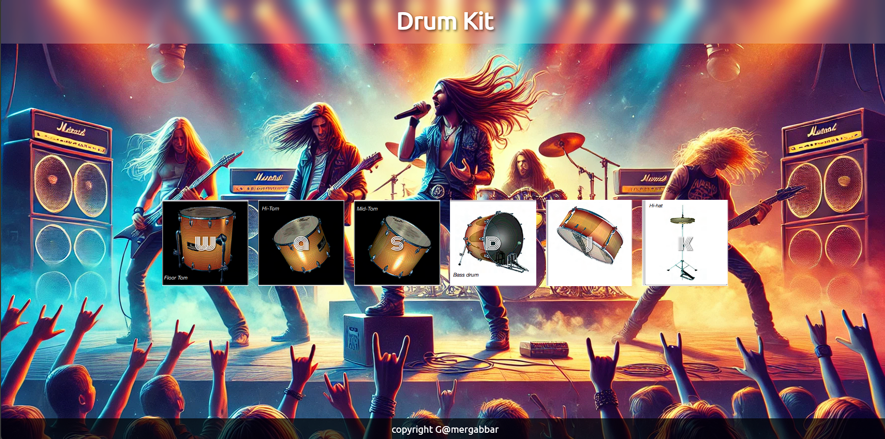

# 🥁 Interactive Drum Kit Web Application

## 📝 Project Description
An interactive web-based drum kit that allows users to play different drum sounds using keyboard keys or mouse clicks. This project demonstrates JavaScript event handling, audio manipulation, and responsive web design.

## 🌟 Features
- Interactive drum buttons
- Keyboard and mouse input support
- Responsive design
- Visual feedback on key press
- Multiple drum sound effects

## 🛠 Technologies Used
- HTML5
- CSS3
- JavaScript
- Responsive Web Design

## 🎹 Keyboard Mapping
- `W`: Floor Tom
- `A`: High Tom
- `S`: Mid Tom
- `D`: Bass Drum
- `J`: Snare Drum
- `K`: Hi-Hat

## 📸 Screenshots


## 🚀 Getting Started

### Prerequisites
- Modern web browser (Chrome, Firefox, Safari, Edge)
- Basic understanding of HTML, CSS, and JavaScript

### Installation
1. Clone the repository
```bash
git clone https://github.com/yourusername/drum-kit.git
```
## 🌐 Live Website
** [https://gamblergabbar.github.io/Drum/]
